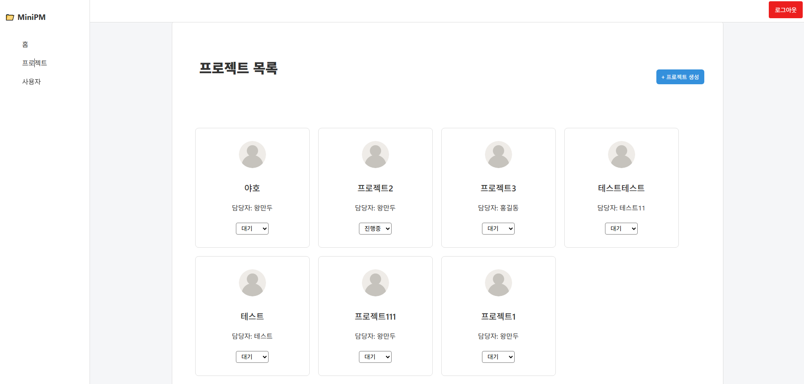
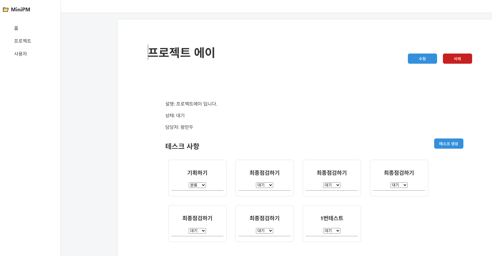
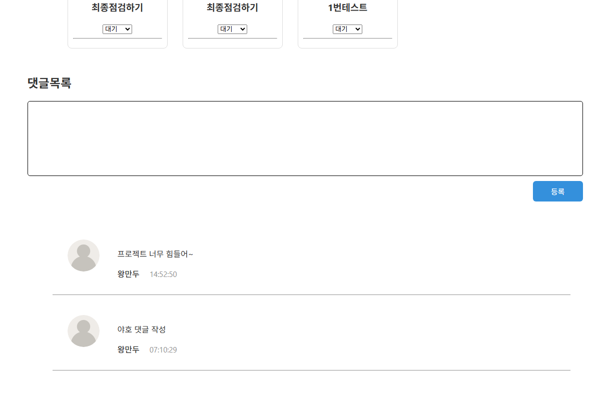
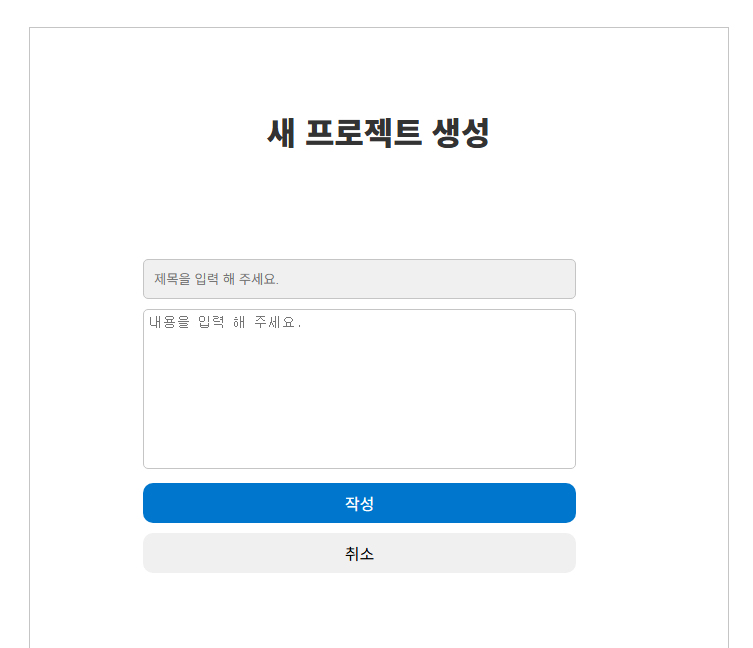
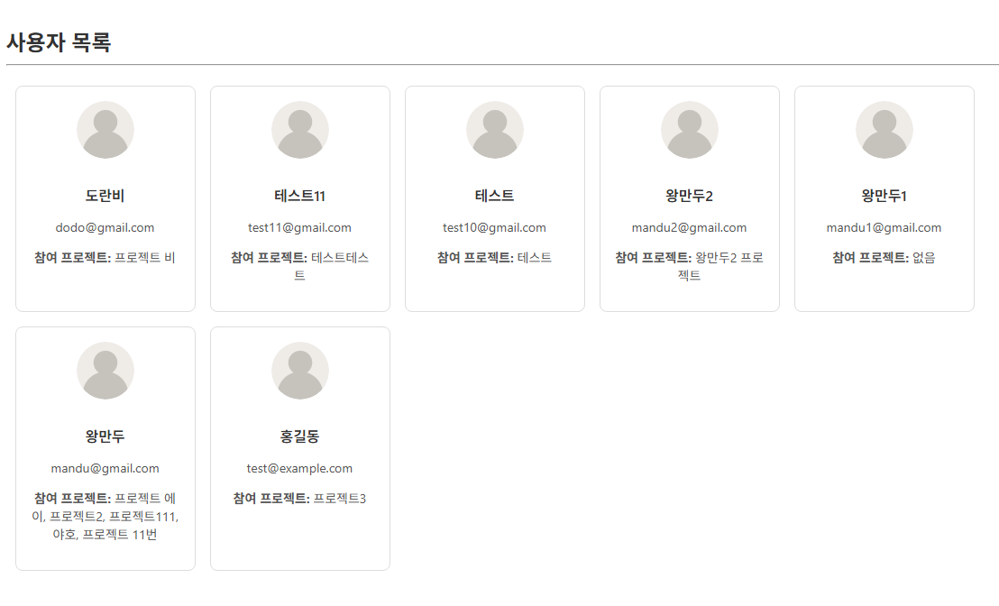

# 프로젝트 이름 : 미니프로젝트 매니저

Vue + Laravel을 이용한 미니 프로젝트 관리 웹페이지

---

## 프로젝트 개요

- Vue3 + Laravel 10 기반 미니 프로젝트 관리 웹
- 회원가입, 로그인, 로그아웃, 프로젝트/테스크, 사용자 관리 기능 구현

---

## 🛠️ 기술 스택

- Frontend: Vue 3 + Vite 
- Backend: Laravel 10 + Sanctum
- DB: MariaDB
- 기타: Axios, Vue Router, Vuex

---

## 📌 주요 기능

| 기능         | 설명                                 |
|--------------|----------------------------------------|
| 회원가입/로그인/로그아웃 | Sanctum 인증 기반 사용자 인증 구현             |
| 프로젝트 관리   | 프로젝트 생성/수정/삭제 기능               |
| 테스크 관리     | 프로젝트별 테스크 생성  |
| 사용자 관리     | 사이트 사용자 정리 및 진행중인 프로젝트 출력 |

---

## 프로젝트 추가 설명

- 회원가입,로그인,로그아웃 sanctum방식으로 제작 
- 로그인 후 프로젝트 페이지, 사용자 페이지 권한
- 사용자 페이지는 관리자 권한 가질시 접근 가능
- 프로젝트 추가 가능(상태:대기->진행중->완료 변경가능)
- 프로젝트 상세 페이지에서 수정,삭제 가능
- 프로젝트 상세 페이지에서 테스크 추가 가능(상태:대기->진행중->완료 변경가능)
- 댓글 출력 및 작성 가능
- 사용자 페이지는 사용자,참여 프로젝트 확인 가능
- 유효하지 않은 url 방지
- 상태(대기->진행중->완료) 별 컬러 추가

---







---

## 💾 설치 방법

```bash
# 백엔드 설치
cd backend
composer create-project laravel/laravel=”10” MiniProject
composer install
php artisan migrate
php artisan serve

# 프론트엔드 설치
cd frontend
npm install
npm run dev
npm install vue-router@4
npm install vuex@next